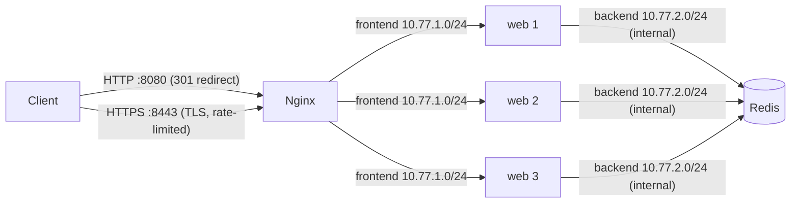
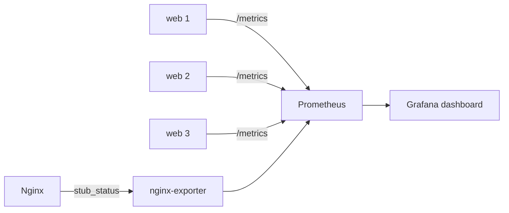
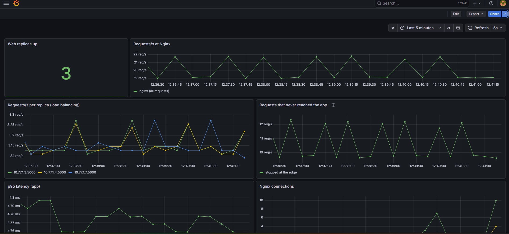
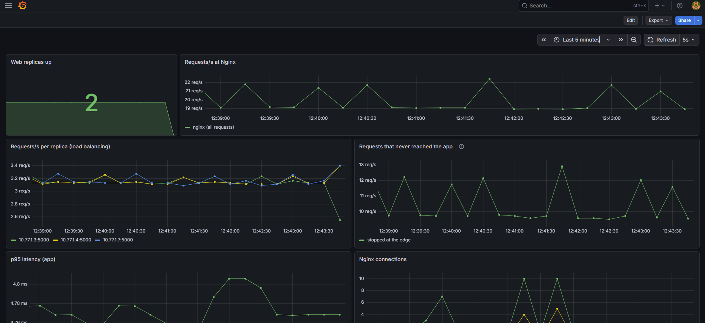

# docker-network-lab


A segmented, load-balanced, TLS-terminated Docker network with built-in observability: Nginx in front, three app replicas behind it, and Redis on a private network that only the app can reach. A 13-check test suite proves the security and resilience properties and runs in CI on every push, alongside an image vulnerability scan. An optional Prometheus + Grafana overlay shows traffic, load balancing, rate limiting and failover live.

## Architecture



## Addressing plan

| Network | Subnet | Fixed addresses | Reachable from host/internet |
|---|---|---|---|
| frontend | 10.77.1.0/24 | nginx 10.77.1.10 | Only Nginx ports 8080 and 8443 |
| backend (internal) | 10.77.2.0/24 | redis 10.77.2.10 | No |

## Security controls

| Control | Implementation | Verified by |
|---|---|---|
| Encryption in transit | TLS 1.2/1.3 on :8443, HTTP redirects with 301 | tests 1-3 |
| Header hardening | HSTS, nosniff, X-Frame-Options, Nginx version hidden | tests 4-5 |
| Network segmentation | Redis on an `internal: true` network | tests 6, 8, 9 |
| Metrics isolation | `/metrics` returns 404 on the public proxy; Nginx status page lives on an unpublished port | test 12 |
| Abuse protection | 10 req/s per IP, burst 20, HTTP 429 beyond that | test 13 |
| Resilience | Failed replica skipped after a 2s connect timeout | test 11 |
| Image security | Trivy scan (HIGH/CRITICAL) in CI, OS patches at build | CI `scan` job |

## Quick start

```bash
./scripts/gen-certs.sh                       # self-signed cert (not committed)
docker compose up -d --build --scale web=3
curl -sk https://localhost:8443/             # -k because the cert is self-signed
```

## Tests

```bash
./scripts/network-test.sh
```

Expected: `Passed: 13  Failed: 0`. The suite covers HTTPS, redirect, TLS 1.3, security headers, version hiding, Redis not exposed, Nginx-to-web reachable, Nginx-to-Redis blocked, web-to-Redis reachable, load spread, failover, hidden metrics and rate limiting. Control tests make sure a "blocked" result is a real block, not a broken tool.

## Observability (optional overlay)

Monitoring lives in a separate Compose file, so the base stack and CI tests stay untouched.

```bash
docker compose -f docker-compose.yml -f docker-compose.monitoring.yml up -d --build --scale web=3
./scripts/load.sh        # in a second terminal: steady traffic plus rate-limit bursts
```

- Grafana: http://localhost:3000 (default login `admin` / `admin`, change it on first login)
- Prometheus: http://localhost:9090



Prometheus finds the replicas through Docker DNS, so scaling `web` up or down is picked up automatically.



| Panel | Shows |
|---|---|
| Web replicas up | How many replicas Prometheus can scrape |
| Requests/s at Nginx | Total traffic entering the edge |
| Requests/s per replica | Load balancing across replicas |
| Requests that never reached the app | Rate-limited, redirected or blocked requests (an approximation: Nginx requests minus app requests) |
| p95 latency | Application response time |
| Nginx connections | Active and waiting connections |

### Failover, as seen on the dashboard

Stopping one replica drops "Web replicas up" to 2 while traffic keeps flowing:



## Try it yourself

```bash
# Redis has no route out (expect: blocked)
docker compose exec -T redis wget -q -T 3 -O- http://1.1.1.1 || echo "blocked"

# Inspect the network design
docker network ls
docker network inspect $(docker network ls -q --filter name=backend)
```

## How this maps to the cloud

| Here | AWS equivalent |
|---|---|
| frontend network + Nginx | public subnet + load balancer |
| web replicas | app tier in an Auto Scaling group |
| backend internal network | private subnet, no internet gateway |
| Network tests | security group / NACL verification |
| Prometheus + Grafana | CloudWatch / managed Prometheus and Grafana |

## Known limitations and roadmap

- The certificate is self-signed, so browsers warn and curl needs `-k`. `mkcert` fixes this for local browsers.
- Nginx resolves `web` at startup, so replicas added later need `docker compose restart nginx`.
- Prometheus and Grafana ports are published for local use only; do not expose them publicly.
- Roadmap: a Terraform deployment of the same layout on AWS.
